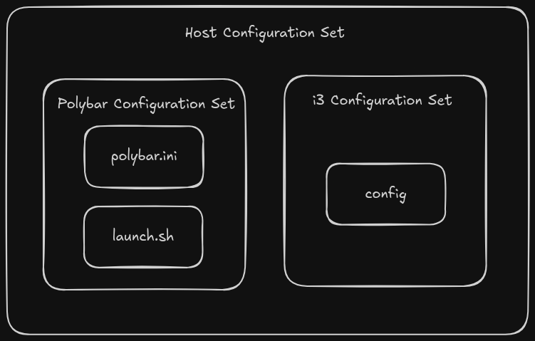

# DotFiles Control

This is a WIP to orginize my thoughts during dev.
Eventually this will be used to store documentation about the tool.

## Concepts

Dotfiles are managed through a collection of files called a host configuration collection, HCC. An
HCC is a collection of configuration sets which is a set of individual configuration files.

For example, An HCC might include configurations for Polybar and i3. The Polybar configuration set
might include two files and the i3 configuration set might include one file.

